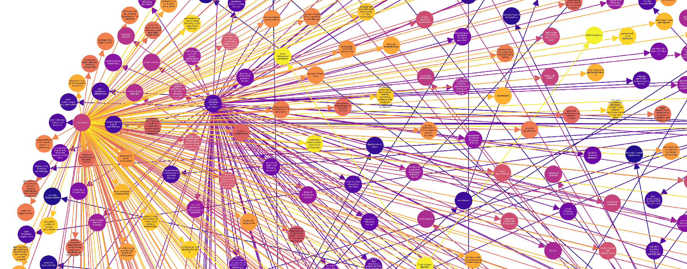

# Geniusrise Healthcare Modules

1. NER using vector knowledge graph search
2. Semantic similarity to find a consistent set of related conditions, diseases,
   etc
3. Graph-based measures to find a consistent set of related conditions,
   diseases, etc
4. Various combinations of the above

# WIP
